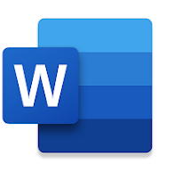

# Microsoft Word  

## `Vendor`
[Microsoft Corporation](https://www.microsoft.com/en-in)

## `Open Source or Proprietary`
Proprietary

## `Description`
Microsoft Word is a word processing software application, widely used as an authoring tool in technical writing.  Some of its key attributes as an authoring tool include:

* **Document Creation:**
From the onset, technical writers can create documents using a friendly interface where they can type, insert images, tables, and other content to start building their technical documents.

* **Formatting and Styling:** 
Font style and size are just a few of the extensive formatting options offered by Word. Such tools are essential to keep consistent formatting throughout a document and to ensure readability.

 * **Tables and Charts:** 
Tables, charts, and other visualization elements are frequently used in technical writing to display data in an organized and succinct format. Word provides the very tools for creating and formatting these various elements.

* **Page Layout:**
Word offers content creators the ability to customize page layout, margins, headers, footers, and page numbering. This is a key aspect in adhering to technical document formatting standards.

* **Spelling and Grammar Check:**
Built-in spelling and grammar checking features ensure high quality and accuracy of technical documents.

* **Collaboration:**
Many users (authors, reviewers, and editors) can work on the same document at the same time and track changes, making the technical writing process much easier to manage.
Citation and References:
Very often, technical writing standards require proper attribution of sources for documents—Word offers various citation styles in support of citation and reference creations.
 
* **Templates:**
Word offers a menu of specifically designed templates for various types of technical documents, such as user manuals, research papers, brochures, troubleshooting guides, whitepapers and reports. These templates ensure that industry standards are upheld and also save a lot of time.

* **Integration:**
Data, charts and presentations can easily be included in technical documents through integrating other Microsoft Office applications such as Excel and PowerPoint into Microsoft Word.

* **Export and Compatibility:**
As already mentioned, Word facilitates easy collaboration with other users by:

  * enabling writers to export their documents, for sharing purposes, to various file formats such as PDF;
  * being widely compatible with different operating systems, allowing other users to easily access and edit documents.

## `Learning Curve`  

The basics of Microsoft Word are fairly easy to learn. However, professional instruction or guided online tutorials may be required to master the more advanced features of Word. Without proper instruction, one may never realize the full array of powerful tools within MS Word. There is a plethora of free online tutorials, Youtube shorts and videos available for many Word features and tools. 

## `Cost Rating`
Microsoft Word can be purchased once off at a price of $159.99. This will include 1 license for 1 PC or Mac. However, you save when you get Word with Microsoft 365! With Microsoft 365 you get Word, plus Excel, PowerPoint, Outlook, and 1 TB of cloud storage per person for all your files, music, photos, videos and more.  
For a business you have different options with Microsoft 365:  

* Basic: $6.00/user/month
* Standard: $12.50/user/month
* Premium: $22.00/user/month
* Apps for Business: $8.25/user/month  

Depending on the size of a business, the number of employees needing to use MS Word, and the scope of the projects, these figures can start adding up.

If you are a freelance technical writer/contractor you will most certainly benefit from purchasing Microsoft 365 Family at $99.99/year. One to six people can share the plan, each person being allowed to use up to 5 devices simultaneously.

## `Microsoft Word Benefits`

* **Find and Replace:**
This powerful feature allows users to replace a word across an entire document with the click of a button.

* **Tracks Change:**
This feature, as outlined in the description section, is useful for other users to review and suggest edits to a specific document.

* **User-Familiarity:**
Most of us have grown up with MS Word, using it both at school and in our working environment. It is the natural “go-to” choice when you need to write anything in a business environment.

* **Mobile App Extendability:**
The features of Microsoft Word also extend to its mobile apps. The mobile app allows writers to access and edit documents on the go, without much fuss, on their mobile devices, while collaborating with other users.

## `Microsoft Word Disadvantages`

* MS Word is not specifically designed for creating user manuals, help files, documentation websites, or eBooks. Consequently, a technical writer may find it difficult to produce accurate and maintainable documentation projects while using this software.
* MS Word is a very complex piece of software trying to do too much. As mentioned in the learning curve, it can be difficult to learn all of its features effectively.
* MS Word focuses on single document editing only. Producing consistently styled, and interlinked documents, or reuse media elements such as pictures and videos, in multiple documents, becomes very problematic.
* It is not easy to make changes in MS Word documents. Future changes in a document may leave you manually making changes throughout the document which also affects the document formatting in other places. This is frustrating, time consuming and an inefficient way to work.

## `OS Requirements`
Microsoft Word runs on Windows 10 or later.

