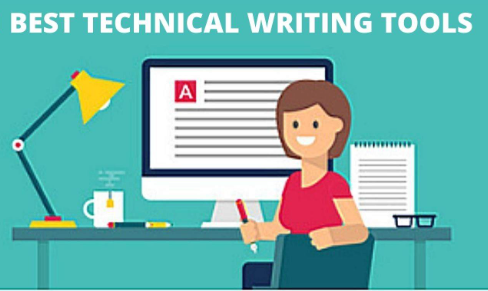

# Tools for Technical Communicators

Technical communiators, especially those using a Docs as Code philosophy, use many tools. This repository gives a summary and review of the more well known and possibly less well known tools. 

For the 2023 Technical Communications GitHub project our OBW students created content about tools in the following areas:

* [Authoring](AuthoringTools/readme.md)
* [Publishing](Publishing-tools/readme.md)
* [Repository](RepositoryTools/readme.md)
* [Content Management](Content_Management_Tools/readme.md)

## Related Topics

* [2023 Roster](https://github.com/Laura-Novich-OBW/student-showcase/tree/main/student-work/2023) - here you will see individual projects
* [Student Showcase](https://github.com/Laura-Novich-OBW/student-showcase/tree/main) - all student projects
  
